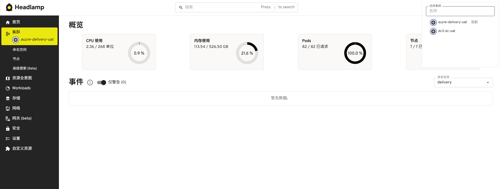
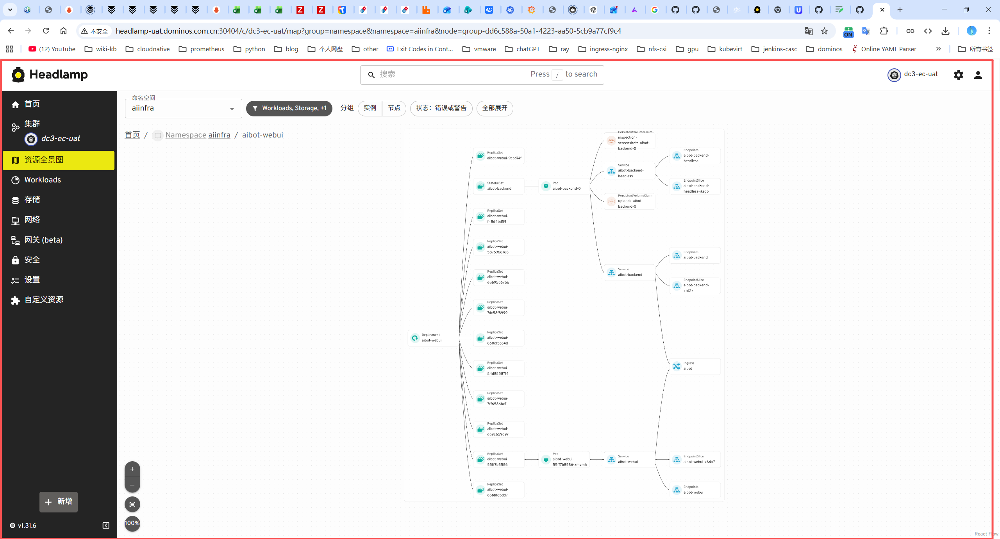

# Headlamp 组件部署

## 1. 创建 ServiceAccount 和 ClusterRoleBinding

### 1.1 创建 ServiceAccount

```bash
kubectl -n kube-system create serviceaccount headlamp-admin
```

### 1.2 创建 ClusterRoleBinding

```bash
kubectl create clusterrolebinding headlamp-admin \
  --serviceaccount=kube-system:headlamp-admin \
  --clusterrole=cluster-admin
```

## 2. 查看 Headlamp 登录 Token

```bash
export HEADLAMP_SECRET=$(kubectl get secrets \
  --namespace kube-system \
  -o custom-columns=":metadata.name" | grep "headlamp-admin-token")

kubectl get secret "$HEADLAMP_SECRET" \
  --namespace kube-system \
  --template=\{\{.data.token\}\} | base64 --decode
```

## 3. 创建 Headlamp 服务

> `-in-cluster-context-name=dc3-aa-cluster` 用于修改 Headlamp UI 中显示的集群名称。

```yaml
kind: Service
apiVersion: v1
metadata:
  name: headlamp
  namespace: kube-system
spec:
  ports:
    - port: 80
      targetPort: 4466
  selector:
    k8s-app: headlamp
---
kind: Deployment
apiVersion: apps/v1
metadata:
  name: headlamp
  namespace: kube-system
spec:
  replicas: 1
  selector:
    matchLabels:
      k8s-app: headlamp
  template:
    metadata:
      labels:
        k8s-app: headlamp
    spec:
      containers:
        - name: headlamp
          image: uhub.service.ucloud.cn/dominos_mwb/headlamp:v0.45.0
          args:
            - "-in-cluster"
            - "-in-cluster-context-name=dc3-aa-cluster"  # 这里改的是 UI 显示的集群名称
            - "-plugins-dir=/headlamp/plugins"
          env:
            - name: HEADLAMP_CONFIG_TRACING_ENABLED
              value: "false"
            - name: HEADLAMP_CONFIG_METRICS_ENABLED
              value: "false"
            - name: HEADLAMP_CONFIG_OTLP_ENDPOINT
              value: "otel-collector:4317"
            - name: HEADLAMP_CONFIG_SERVICE_NAME
              value: "headlamp"
            - name: HEADLAMP_CONFIG_SERVICE_VERSION
              value: "v0.45.0"
          ports:
            - containerPort: 4466
              name: http
            - containerPort: 9090
              name: metrics
          readinessProbe:
            httpGet:
              scheme: HTTP
              path: /
              port: 4466
            initialDelaySeconds: 30
            timeoutSeconds: 30
          livenessProbe:
            httpGet:
              scheme: HTTP
              path: /
              port: 4466
            initialDelaySeconds: 30
            timeoutSeconds: 30
      nodeSelector:
        'kubernetes.io/os': linux
---
kind: Secret
apiVersion: v1
metadata:
  name: headlamp-admin
  namespace: kube-system
  annotations:
    kubernetes.io/service-account.name: "headlamp-admin"
type: kubernetes.io/service-account-token
```

## 4. 创建 Ingress 规则（Ingress-NGINX）

```yaml
apiVersion: networking.k8s.io/v1
kind: Ingress
metadata:
  name: headlamp-ingress
  namespace: kube-system
spec:
  ingressClassName: nginx
  rules:
    - host: headlamp-ui.dominos.com.cn
      http:
        paths:
          - backend:
              service:
                name: headlamp
                port:
                  number: 80
            path: /
            pathType: Prefix
```

## 5. 创建 IngressRoute 并增加认证（Traefik）

> Basic Auth 可以不加，Headlamp 前端本身也需要使用 Token 才可以访问。

### 5.1 不增加 Basic Auth 的 IngressRoute

```yaml
apiVersion: traefik.io/v1alpha1
kind: IngressRoute
metadata:
  name: headlamp-webui
  namespace: kube-system
spec:
  entryPoints:
    - web
  routes:
    - kind: Rule
      match: Host(`headlamp-uat.dominos.com.cn`)
      services:
        - name: headlamp
          port: 80
```

### 5.2 创建 Basic Auth 认证文件和 Secret

```bash
htpasswd -c auth admin
cat auth
```

认证文件示例：

```text
admin:$apr1$4YpFOMjN$msWYXMT5RQjOkXpa3HTTB.
```

创建 Secret：

```bash
kubectl create secret generic headlamp-basic-auth \
  --from-file=auth \
  -n kube-system
```

### 5.3 创建 Basic Auth Middleware

```yaml
apiVersion: traefik.io/v1alpha1
kind: Middleware
metadata:
  name: headlamp-basic-auth
  namespace: kube-system
spec:
  basicAuth:
    secret: headlamp-basic-auth
```

### 5.4 IngressRoute 引用 Basic Auth Middleware

```yaml
apiVersion: traefik.io/v1alpha1
kind: IngressRoute
metadata:
  name: headlamp-webui
  namespace: kube-system
spec:
  entryPoints:
    - web
  routes:
    - kind: Rule
      match: Host(`headlamp-uat.dominos.com.cn`)
      middlewares:
        - name: headlamp-basic-auth
      services:
        - name: headlamp
          port: 80
```

## 6. 纳管多个集群

### 6.1 创建 Headlamp Kubeconfig Secret

```bash
kubectl -n kube-system create secret generic headlamp-kubeconfigs \
  --from-file=uat2=./uat2-kubeconfig
```

其中：

- `uat2` 是 Secret 中的 key；
- 后续 `-kubeconfig` 参数中的文件名需要与这个 key 保持一致；
- `uat2` 并不是目标集群的 context name。

### 6.2 更新 Headlamp Deployment

原文说明：更多集群时可使用 `:` 分割，例如：

```text
/headlamp/kubeconfig/prod:/headlamp/kubeconfig/dev:/headlamp/kubeconfig/fun
```

Deployment 中增加 kubeconfig 参数和挂载：

```yaml
spec:
  containers:
    - args:
        - -in-cluster
        - -in-cluster-context-name=auzre-delivery-uat
        - -kubeconfig=/home/headlamp/.config/Headlamp/kubeconfigs/uat2
        - -plugins-dir=/headlamp/plugins
      volumeMounts:
        - mountPath: /home/headlamp/.config/Headlamp/kubeconfigs/
          name: kubeconfig
          readOnly: true

  volumes:
    - name: kubeconfig
      secret:
        defaultMode: 420
        secretName: headlamp-kubeconfigs
```

> `-kubeconfig=/home/headlamp/.config/Headlamp/kubeconfigs/uat2` 中的 `uat2` 对应前面 Secret 中的 key，而不是集群的 context name。

## 7. 展示效果

### 7.1 多集群概览



### 7.2 集群资源拓扑


