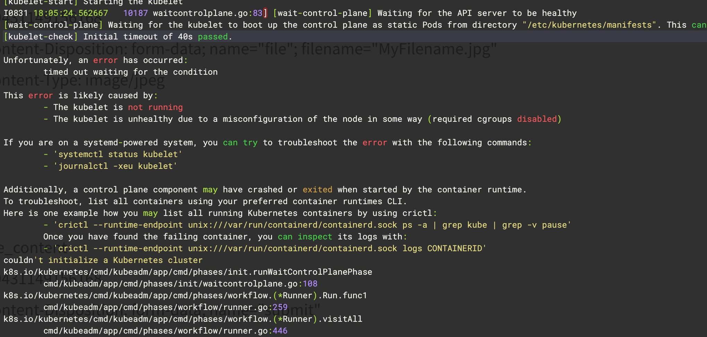

# 记 Kubernetes 1.28.1 之 Kubeadm 安装过程 - 单 master 集群

## 节点初始化配置

1. 更改主机名配置 `hosts`

   ```shell
   hostnamectl set-hostname --static k8s-master
   hostnamectl set-hostname --static k8s-worker01
   
   echo '10.2x.2x9.6x k8s-master' >> /etc/hosts
   echo '10.2x.2x9.6x k8s-worker01' >> /etc/hosts
   ```

2. 禁用 `firewalld、selinux、swap`

   ```shell
   systemctl stop firewalld && systemctl disable firewalld 
   
   sed -i 's/SELINUX=enforcing/SELINUX=disabled/g' /etc/selinux/config && setenforce 0 && getenforce
   
   swapoff -a && sed -i 's@/dev/mapper/centos-swap@#/dev/mapper/centos-swap@g' /etc/fstab
   ```

3. 系统优化

   ```shell
   - 加载模块
   cat <<EOF | sudo tee /etc/modules-load.d/k8s.conf
   overlay
   br_netfilter
   ip_vs
   ip_vs_rr
   ip_vs_wrr
   ip_vs_sh
   nf_conntrack_ipv4
   EOF
   
   modprobe -- ip_vs
   modprobe -- ip_vs_rr
   modprobe -- ip_vs_wrr
   modprobe -- ip_vs_sh
   modprobe -- nf_conntrack_ipv4
   modprobe -- overlay
   modprobe -- br_netfilter
   
   - 检查是否生效
   lsmod | grep ip_vs && lsmod | grep nf_conntrack_ipv4
   
   - 配置 ipv4 转发内核参数
   cat > /etc/sysctl.d/k8s.conf << EOF
   net.bridge.bridge-nf-call-ip6tables = 1
   net.bridge.bridge-nf-call-iptables = 1
   net.ipv4.ip_forward = 1
   vm.swappiness = 0
   EOF
   sysctl -p && sysctl --system
   
   - 检查内核参数是否生效
   sysctl net.bridge.bridge-nf-call-iptables net.bridge.bridge-nf-call-ip6tables net.ipv4.ip_forward
   ```

4. 其余配置

   ```shell
   - 根分区扩容 # 可选步骤
   lsblk 
   pvcreate /dev/sdb
   vgextend centos /dev/sdb 
   lvextend -L +99G /dev/mapper/centos-root 
   xfs_growfs /dev/mapper/centos-root 
   
   - 配置阿里源
   wget -O /etc/yum.repos.d/epel.repo https://mirrors.aliyun.com/repo/epel-7.repo
   
   - 安装常用工具
   yum install -y ipvsadm ipset sysstat conntrack libseccomp wget git net-tools bash-completion
   ```

## 安装必要组件

1. [安装容器运行时<CRI>](https://kubernetes.io/zh-cn/docs/setup/production-environment/container-runtimes/)

   - cgroup

     - cgroupfs 驱动：是 kubelet 中默认的 cgroup 驱动。 当使用 cgroupfs 驱动时， kubelet 和容器运行时将直接对接 cgroup 文件系统来配置 cgroup
     - systemd 驱动：某个 Linux 系统发行版使用 systemd 作为其初始化系统时，初始化进程会生成并使用一个 root 控制组（cgroup），并充当 cgroup 管理器

     - 同时存在两个 cgroup 管理器将造成系统中针对可用的资源和使用中的资源出现两个视图。某些情况下， 将 kubelet 和容器运行时配置为使用 `cgroupfs`、但为剩余的进程使用 `systemd` 的那些节点将在资源压力增大时变得不稳定，所以我们要保证 kubelet 和 docker 的驱动跟系统保持一致，均为 systemd

   - 安装 containerd

   ```shell
   - 解压并将二进制文件放入 /usr/local/ 目录下
   tar Cxzvf /usr/local containerd-1.7.5-linux-amd64.tar.gz
   bin/
   bin/containerd-shim-runc-v2
   bin/containerd-shim
   bin/ctr
   bin/containerd-shim-runc-v1
   bin/containerd
   bin/containerd-stress
   
   - 配置systemd # 默认会生成
   vi /usr/lib/systemd/system/containerd.service
   [Unit]
   Description=containerd container runtime
   Documentation=https://containerd.io
   After=network.target local-fs.target
   
   [Service]
   #uncomment to enable the experimental sbservice (sandboxed) version of containerd/cri integration
   #Environment="ENABLE_CRI_SANDBOXES=sandboxed"
   ExecStartPre=-/sbin/modprobe overlay
   ExecStart=/usr/local/bin/containerd
   
   Type=notify
   Delegate=yes
   KillMode=process
   Restart=always
   RestartSec=5
   # Having non-zero Limit*s causes performance problems due to accounting overhead
   # in the kernel. We recommend using cgroups to do container-local accounting.
   LimitNPROC=infinity
   LimitCORE=infinity
   LimitNOFILE=infinity
   # Comment TasksMax if your systemd version does not supports it.
   # Only systemd 226 and above support this version.
   TasksMax=infinity
   OOMScoreAdjust=-999
   
   [Install]
   WantedBy=multi-user.target
    
   - 生成默认配置文件
   mkdir -p /etc/containerd/
   containerd config default >> /etc/containerd/config.toml
   
   - cgroup 驱动更改为 systemd
   vi /etc/containerd/config.toml
   [plugins."io.containerd.grpc.v1.cri".containerd.runtimes.runc]
     ...
     [plugins."io.containerd.grpc.v1.cri".containerd.runtimes.runc.options]
       SystemdCgroup = true
       
   - 修改 containerd 默认的 pause 镜像 # 默认为境外镜像由于网络问题需要更改为国内源
   vi /etc/containerd/config.toml
   [plugins."io.containerd.grpc.v1.cri"]
     sandbox_image = "k8s.m.daocloud.io/pause:3.9" # 更改为 k8s.m.daocloud.io，默认为 registry.k8s.io
     
   - 重启 containerd 
   systemctl daemon-reload && systemctl restart containerd
   ```

   - 安装 runc

   ```shell
   install -m 755 runc.amd64 /usr/local/sbin/runc
   ```

   - 安装 cni - 建议不执行、安装 kubelet 时会自动安装(使用最新的 cni，可能会出现兼容性问题)

   ```shell
   mkdir -p /opt/cni/bin
   tar Cxzvf /opt/cni/bin cni-plugins-linux-amd64-v1.3.0.tgz 
   ./
   ./macvlan
   ./static
   ./vlan
   ./portmap
   ./host-local
   ./vrf
   ./bridge
   ./tuning
   ./firewall
   ./host-device
   ./sbr
   ./loopback
   ./dhcp
   ./ptp
   ./ipvlan
   ./bandwidth
   ```

2. [安装 kubeadm、kubelet、kubectl](https://kubernetes.io/zh-cn/docs/setup/production-environment/tools/kubeadm/install-kubeadm/) [kubelet 配置文件](https://kubernetes.io/docs/tasks/administer-cluster/kubelet-config-file/)

   - 配置 kubernests 源并安装

   ```shell
   [root@k8s-master yum.repos.d]# cat <<EOF > /etc/yum.repos.d/kubernetes.repo
   [kubernetes]
   name=Kubernetes
   baseurl=https://mirrors.aliyun.com/kubernetes/yum/repos/kubernetes-el7-x86_64/
   enabled=1
   gpgcheck=1
   repo_gpgcheck=1
   gpgkey=https://mirrors.aliyun.com/kubernetes/yum/doc/yum-key.gpg https://mirrors.aliyun.com/kubernetes/yum/doc/rpm-package-key.gpg
   EOF
   
   - 查看对应组件版本并指定安装版本 # 可选
   [root@k8s-master yum.repos.d]# yum list kubeadm --showduplicates
   [root@k8s-master yum.repos.d]# yum list kubectl --showduplicates
   [root@k8s-master yum.repos.d]# yum install --setopt=obsoletes=0 kubeadm-1.17.4-0 kubelet-1.17.4-0 kubectl-1.17.4-0 -y
   
   - 安装 kubeadm、kubectl 组件
   [root@k8s-master yum.repos.d]# yum install kubelet kubeadm kubectl --disableexcludes=kubernetes
   Loaded plugins: fastestmirror
   Loading mirror speeds from cached hostfile
    * base: mirrors.ustc.edu.cn
    * extras: mirrors.ustc.edu.cn
    * updates: ftp.sjtu.edu.cn
   base                                                                                                                                     | 3.6 kB  00:00:00     
   extras                                                                                                                                   | 2.9 kB  00:00:00     
   kubernetes                                                                                                                               | 1.4 kB  00:00:00     
   updates                                                                                                                                  | 2.9 kB  00:00:00     
   (1/5): base/7/x86_64/group_gz                                                                                                            | 153 kB  00:00:00     
   (2/5): extras/7/x86_64/primary_db                                                                                                        | 250 kB  00:00:00     
   (3/5): kubernetes/primary                                                                                                                | 136 kB  00:00:00     
   (4/5): updates/7/x86_64/primary_db                                                                                                       |  22 MB  00:00:02     
   (5/5): base/7/x86_64/primary_db                                                                                                          | 6.1 MB  00:00:13     
   kubernetes                                                                                                                                            1010/1010
   Resolving Dependencies
   --> Running transaction check
   ---> Package kubeadm.x86_64 0:1.28.1-0 will be installed
   --> Processing Dependency: kubernetes-cni >= 0.8.6 for package: kubeadm-1.28.1-0.x86_64
   --> Processing Dependency: cri-tools >= 1.19.0 for package: kubeadm-1.28.1-0.x86_64
   ---> Package kubectl.x86_64 0:1.28.1-0 will be installed
   ---> Package kubelet.x86_64 0:1.28.1-0 will be installed
   --> Processing Dependency: socat for package: kubelet-1.28.1-0.x86_64
   --> Processing Dependency: conntrack for package: kubelet-1.28.1-0.x86_64
   --> Running transaction check
   ---> Package conntrack-tools.x86_64 0:1.4.4-7.el7 will be installed
   --> Processing Dependency: libnetfilter_cttimeout.so.1(LIBNETFILTER_CTTIMEOUT_1.1)(64bit) for package: conntrack-tools-1.4.4-7.el7.x86_64
   --> Processing Dependency: libnetfilter_cttimeout.so.1(LIBNETFILTER_CTTIMEOUT_1.0)(64bit) for package: conntrack-tools-1.4.4-7.el7.x86_64
   --> Processing Dependency: libnetfilter_cthelper.so.0(LIBNETFILTER_CTHELPER_1.0)(64bit) for package: conntrack-tools-1.4.4-7.el7.x86_64
   --> Processing Dependency: libnetfilter_queue.so.1()(64bit) for package: conntrack-tools-1.4.4-7.el7.x86_64
   --> Processing Dependency: libnetfilter_cttimeout.so.1()(64bit) for package: conntrack-tools-1.4.4-7.el7.x86_64
   --> Processing Dependency: libnetfilter_cthelper.so.0()(64bit) for package: conntrack-tools-1.4.4-7.el7.x86_64
   ---> Package cri-tools.x86_64 0:1.26.0-0 will be installed
   ---> Package kubernetes-cni.x86_64 0:1.2.0-0 will be installed
   ---> Package socat.x86_64 0:1.7.3.2-2.el7 will be installed
   --> Running transaction check
   ---> Package libnetfilter_cthelper.x86_64 0:1.0.0-11.el7 will be installed
   ---> Package libnetfilter_cttimeout.x86_64 0:1.0.0-7.el7 will be installed
   ---> Package libnetfilter_queue.x86_64 0:1.0.2-2.el7_2 will be installed
   --> Finished Dependency Resolution
   
   Dependencies Resolved
   
   ================================================================================================================================================================
    Package                                        Arch                           Version                                 Repository                          Size
   ================================================================================================================================================================
   Installing:
    kubeadm                                        x86_64                         1.28.1-0                                kubernetes                          11 M
    kubectl                                        x86_64                         1.28.1-0                                kubernetes                          11 M
    kubelet                                        x86_64                         1.28.1-0                                kubernetes                          21 M
   Installing for dependencies:
    conntrack-tools                                x86_64                         1.4.4-7.el7                             base                               187 k
    cri-tools                                      x86_64                         1.26.0-0                                kubernetes                         8.6 M
    kubernetes-cni                                 x86_64                         1.2.0-0                                 kubernetes                          17 M  # cni 会安装 /opt/cni/bin/ 网络插件，也就是当前 k8s 版本所兼容的
    libnetfilter_cthelper                          x86_64                         1.0.0-11.el7                            base                                18 k
    libnetfilter_cttimeout                         x86_64                         1.0.0-7.el7                             base                                18 k
    libnetfilter_queue                             x86_64                         1.0.2-2.el7_2                           base                                23 k
    socat                                          x86_64                         1.7.3.2-2.el7                           base                               290 k
   
   Transaction Summary
   ================================================================================================================================================================
   Install  3 Packages (+7 Dependent packages)
   
   Total download size: 69 M
   Installed size: 292 M
   Is this ok [y/d/N]: y # y 进行安装即可
   ```

   ⚠️：由于官网未开放同步方式, 可能会有 gpg 检查失败的情况, 请用 `yum install -y --nogpgcheck kubelet kubeadm kubectl` 安装来规避 gpg-key 的检查

   - 启动 kubelet

   ```shell
   - 启动 kubelet 服务
   [root@k8s-master ~]# systemctl enable kubelet && systemctl start kubelet && systemctl status kubelet
   Created symlink from /etc/systemd/system/multi-user.target.wants/kubelet.service to /usr/lib/systemd/system/kubelet.service.
   ● kubelet.service - kubelet: The Kubernetes Node Agent
      Loaded: loaded (/usr/lib/systemd/system/kubelet.service; enabled; vendor preset: disabled)
     Drop-In: /usr/lib/systemd/system/kubelet.service.d
              └─10-kubeadm.conf
      Active: active (running) since Thu 2023-08-31 16:00:25 CST; 11ms ago
        Docs: https://kubernetes.io/docs/
    Main PID: 3011 (kubelet)
      CGroup: /system.slice/kubelet.service
              └─3011 /usr/bin/kubelet --bootstrap-kubeconfig=/etc/kubernetes/bootstrap-kubelet.conf --kubeconfig=/etc/kubernetes/kubelet.conf --config=/var/lib/...
   ```

## 初始化集群配置

1. [kubeadm 拉取镜像](https://kubernetes.io/zh-cn/docs/setup/production-environment/tools/kubeadm/create-cluster-kubeadm/)

   - 拉取必要镜像 [Daocloud-镜像源](https://github.com/DaoCloud/public-image-mirror)

   ```shell
   - 确认现有版本 kubeadm、kubelet 所需要的镜像版本
   [root@k8s-master ~]# kubeadm config images list 
   registry.k8s.io/kube-apiserver:v1.28.1
   registry.k8s.io/kube-controller-manager:v1.28.1
   registry.k8s.io/kube-scheduler:v1.28.1
   registry.k8s.io/kube-proxy:v1.28.1
   registry.k8s.io/pause:3.9
   registry.k8s.io/etcd:3.5.9-0
   registry.k8s.io/coredns/coredns:v1.10.1
   
   - 拉取指定的镜像版本(Daocloud源)
   [root@k8s-master ~]# kubeadm config images pull --image-repository k8s.m.daocloud.io --kubernetes-version v1.28.1
   [config/images] Pulled k8s.m.daocloud.io/kube-apiserver:v1.28.1
   [config/images] Pulled k8s.m.daocloud.io/kube-controller-manager:v1.28.1
   [config/images] Pulled k8s.m.daocloud.io/kube-scheduler:v1.28.1
   [config/images] Pulled k8s.m.daocloud.io/kube-proxy:v1.28.1
   [config/images] Pulled k8s.m.daocloud.io/pause:3.9
   [config/images] Pulled k8s.m.daocloud.io/etcd:3.5.9-0
   [config/images] Pulled k8s.m.daocloud.io/coredns:v1.10.1
   
   - 拉取指定镜像版本()
   [root@k8s-master ~]# kubeadm config images pull --image-repository registry.aliyuncs.com/google_containers --kubernetes-version v1.28.1
   [config/images] Pulled registry.aliyuncs.com/google_containers/kube-apiserver:v1.28.1
   [config/images] Pulled registry.aliyuncs.com/google_containers/kube-controller-manager:v1.28.1
   [config/images] Pulled registry.aliyuncs.com/google_containers/kube-scheduler:v1.28.1
   [config/images] Pulled registry.aliyuncs.com/google_containers/kube-proxy:v1.28.1
   [config/images] Pulled registry.aliyuncs.com/google_containers/pause:3.9
   [config/images] Pulled registry.aliyuncs.com/google_containers/etcd:3.5.9-0
   [config/images] Pulled registry.aliyuncs.com/google_containers/coredns:v1.10.1
   ```

2. 生成初始化集群配置文件 [kubeadm init](https://kubernetes.io/zh-cn/docs/reference/setup-tools/kubeadm/kubeadm-init/#config-file)  [kubelet](https://kubernetes.io/docs/setup/production-environment/tools/kubeadm/kubelet-integration/)

   ```shell
    - 打印一个默认的集群配置文件
   [root@k8s-master ~]# kubeadm config print init-defaults
    - 打印一个默认的集群配置文件 - 关于 kubelet 默认配置
   kubeadm config print init-defaults --component-configs KubeletConfiguration
   ```

   ```yaml
   # clusterConfigfile
   apiVersion: kubeadm.k8s.io/v1beta3
   bootstrapTokens:
   - groups:
     - system:bootstrappers:kubeadm:default-node-token
     token: abcdef.0123456789abcdef
     ttl: 24h0m0s
     usages:
     - signing
     - authentication
   kind: InitConfiguration
   localAPIEndpoint:
     advertiseAddress: 10.2x.20x.6x # 更改为节点 ip
     bindPort: 6443
   nodeRegistration:
     criSocket: unix:///var/run/containerd/containerd.sock
     imagePullPolicy: IfNotPresent
     name: k8s-master # 更改为节点主机名
     taints: null
   ---
   apiServer:
     timeoutForControlPlane: 4m0s # kubeadm install 集群时的超市时间
   apiVersion: kubeadm.k8s.io/v1beta3
   certificatesDir: /etc/kubernetes/pki
   clusterName: kubernetes
   controllerManager: {}
   dns: {}
   etcd:
     local:
       dataDir: /var/lib/etcd
   imageRepository: k8s.m.daocloud.io # 更改为 k8s.m.daocloud.io，默认 registry.k8s.io
   kind: ClusterConfiguration
   kubernetesVersion: 1.28.1        # 修改 k8s 版本
   networking:
     dnsDomain: cluster.local
     podSubnet: 172.16.15.0/22       # 集群的 pod ip 段，冲突的话需要更改
     serviceSubnet: 10.96.0.0/12     # 集群的 service ip 段，冲突的话需要更改
   scheduler: {}
   ---
   kind: KubeletConfiguration
   apiVersion: kubelet.config.k8s.io/v1beta1
   cgroupDriver: systemd             # 与系统和 containerd 使用一致的 cgroup 驱动
   ```

## 部署集群

1. 使用 `mawb-ClusterConfig.yaml ` 安装集群

   ```shell
   [root@k8s-master ~]# kubeadm init --config mawb-ClusterConfig.yaml 
   [init] Using Kubernetes version: v1.28.1
   [preflight] Running pre-flight checks
   [preflight] Pulling images required for setting up a Kubernetes cluster
   [preflight] This might take a minute or two, depending on the speed of your internet connection
   [preflight] You can also perform this action in beforehand using 'kubeadm config images pull'
   W0831 17:52:06.298929    9686 checks.go:835] detected that the sandbox image "registry.k8s.io/pause:3.8" of the container runtime is inconsistent with that used by kubeadm. It is recommended that using "k8s.m.daocloud.io/pause:3.9" as the CRI sandbox image.
   [certs] Using certificateDir folder "/etc/kubernetes/pki"
   [certs] Generating "ca" certificate and key
   [certs] Generating "apiserver" certificate and key
   [certs] apiserver serving cert is signed for DNS names [k8s-master kubernetes kubernetes.default kubernetes.default.svc kubernetes.default.svc.cluster.local] and IPs [10.96.0.1 10.2x.2x9.6x]
   [certs] Generating "apiserver-kubelet-client" certificate and key
   [certs] Generating "front-proxy-ca" certificate and key
   [certs] Generating "front-proxy-client" certificate and key
   [certs] Generating "etcd/ca" certificate and key
   [certs] Generating "etcd/server" certificate and key
   [certs] etcd/server serving cert is signed for DNS names [k8s-master localhost] and IPs [10.2x.2x9.6x 127.0.0.1 ::1]
   [certs] Generating "etcd/peer" certificate and key
   [certs] etcd/peer serving cert is signed for DNS names [k8s-master localhost] and IPs [10.2x.2x9.6x 127.0.0.1 ::1]
   [certs] Generating "etcd/healthcheck-client" certificate and key
   [certs] Generating "apiserver-etcd-client" certificate and key
   [certs] Generating "sa" key and public key
   [kubeconfig] Using kubeconfig folder "/etc/kubernetes"
   [kubeconfig] Writing "admin.conf" kubeconfig file
   [kubeconfig] Writing "kubelet.conf" kubeconfig file
   [kubeconfig] Writing "controller-manager.conf" kubeconfig file
   [kubeconfig] Writing "scheduler.conf" kubeconfig file
   [etcd] Creating static Pod manifest for local etcd in "/etc/kubernetes/manifests"
   [control-plane] Using manifest folder "/etc/kubernetes/manifests"
   [control-plane] Creating static Pod manifest for "kube-apiserver"
   [control-plane] Creating static Pod manifest for "kube-controller-manager"
   [control-plane] Creating static Pod manifest for "kube-scheduler"
   [kubelet-start] Writing kubelet environment file with flags to file "/var/lib/kubelet/kubeadm-flags.env"
   [kubelet-start] Writing kubelet configuration to file "/var/lib/kubelet/config.yaml"
   [kubelet-start] Starting the kubelet
   [wait-control-plane] Waiting for the kubelet to boot up the control plane as static Pods from directory "/etc/kubernetes/manifests". This can take up to 4m0s
   [kubelet-check] Initial timeout of 40s passed.
   [apiclient] All control plane components are healthy after 10.507981 seconds
   I0831 20:19:17.452642    9052 uploadconfig.go:112] [upload-config] Uploading the kubeadm ClusterConfiguration to a ConfigMap
   [upload-config] Storing the configuration used in ConfigMap "kubeadm-config" in the "kube-system" Namespace
   I0831 20:19:17.498585    9052 uploadconfig.go:126] [upload-config] Uploading the kubelet component config to a ConfigMap
   [kubelet] Creating a ConfigMap "kubelet-config" in namespace kube-system with the configuration for the kubelets in the cluster
   I0831 20:19:17.536230    9052 uploadconfig.go:131] [upload-config] Preserving the CRISocket information for the control-plane node
   I0831 20:19:17.536386    9052 patchnode.go:31] [patchnode] Uploading the CRI Socket information "unix:///var/run/containerd/containerd.sock" to the Node API object "k8s-master" as an annotation
   [upload-certs] Skipping phase. Please see --upload-certs
   [mark-control-plane] Marking the node k8s-master as control-plane by adding the labels: [node-role.kubernetes.io/control-plane node.kubernetes.io/exclude-from-external-load-balancers]
   [mark-control-plane] Marking the node k8s-master as control-plane by adding the taints [node-role.kubernetes.io/control-plane:NoSchedule]
   [bootstrap-token] Using token: abcdef.0123456789abcdef
   [bootstrap-token] Configuring bootstrap tokens, cluster-info ConfigMap, RBAC Roles
   [bootstrap-token] Configured RBAC rules to allow Node Bootstrap tokens to get nodes
   [bootstrap-token] Configured RBAC rules to allow Node Bootstrap tokens to post CSRs in order for nodes to get long term certificate credentials
   [bootstrap-token] Configured RBAC rules to allow the csrapprover controller automatically approve CSRs from a Node Bootstrap Token
   [bootstrap-token] Configured RBAC rules to allow certificate rotation for all node client certificates in the cluster
   [bootstrap-token] Creating the "cluster-info" ConfigMap in the "kube-public" namespace
   I0831 20:19:19.159977    9052 clusterinfo.go:47] [bootstrap-token] loading admin kubeconfig
   I0831 20:19:19.160881    9052 clusterinfo.go:58] [bootstrap-token] copying the cluster from admin.conf to the bootstrap kubeconfig
   I0831 20:19:19.161567    9052 clusterinfo.go:70] [bootstrap-token] creating/updating ConfigMap in kube-public namespace
   I0831 20:19:19.182519    9052 clusterinfo.go:84] creating the RBAC rules for exposing the cluster-info ConfigMap in the kube-public namespace
   I0831 20:19:19.209727    9052 kubeletfinalize.go:90] [kubelet-finalize] Assuming that kubelet client certificate rotation is enabled: found "/var/lib/kubelet/pki/kubelet-client-current.pem"
   [kubelet-finalize] Updating "/etc/kubernetes/kubelet.conf" to point to a rotatable kubelet client certificate and key
   I0831 20:19:19.215469    9052 kubeletfinalize.go:134] [kubelet-finalize] Restarting the kubelet to enable client certificate rotation
   [addons] Applied essential addon: CoreDNS
   [addons] Applied essential addon: kube-proxy
   
   Your Kubernetes control-plane has initialized successfully!
   
   To start using your cluster, you need to run the following as a regular user: #当前用户执行，使 kubectl 可以访问/管理集群
   
     mkdir -p $HOME/.kube
     sudo cp -i /etc/kubernetes/admin.conf $HOME/.kube/config
     sudo chown $(id -u):$(id -g) $HOME/.kube/config
   
   Alternatively, if you are the root user, you can run:
   
     export KUBECONFIG=/etc/kubernetes/admin.conf
   
   You should now deploy a pod network to the cluster.
   Run "kubectl apply -f [podnetwork].yaml" with one of the options listed at:
     https://kubernetes.io/docs/concepts/cluster-administration/addons/
   
   Then you can join any number of worker nodes by running the following on each as root:
   
   kubeadm join 10.2x.20x.6x:6443 --token abcdef.0123456789abcdef \
           --discovery-token-ca-cert-hash sha256:3c96533e9c86dcb7fc4b1998716bff804685ef6d40a6635e3357cb92eb4645ed
   ```

2. 配置 kubectl client 使其可以访问、管理集群

   ```shell
   To start using your cluster, you need to run the following as a regular user: #当前用户执行，使 kubectl 可以访问/管理集群
   
     mkdir -p $HOME/.kube
     sudo cp -i /etc/kubernetes/admin.conf $HOME/.kube/config
     sudo chown $(id -u):$(id -g) $HOME/.kube/config
   
   Alternatively, if you are the root user, you can run:
   
     export KUBECONFIG=/etc/kubernetes/admin.conf
   ```

   

## 接入 worker 节点

1. cri 安装请参考上面步骤

2. kubelet 安装请参考上面步骤

3. 节点接入

   ```shell
   [root@k8s-worker01 ~]# kubeadm join 10.2x.20x.6x:6443 --token abcdef.0123456789abcdef \
   >         --discovery-token-ca-cert-hash sha256:3c96533e9c86dcb7fc4b1998716bff804685ef6d40a6635e3357cb92eb4645ed
   [preflight] Running pre-flight checks
   [preflight] Reading configuration from the cluster...
   [preflight] FYI: You can look at this config file with 'kubectl -n kube-system get cm kubeadm-config -o yaml'
   [kubelet-start] Writing kubelet configuration to file "/var/lib/kubelet/config.yaml"
   [kubelet-start] Writing kubelet environment file with flags to file "/var/lib/kubelet/kubeadm-flags.env"
   [kubelet-start] Starting the kubelet
   [kubelet-start] Waiting for the kubelet to perform the TLS Bootstrap...
   
   This node has joined the cluster:
   * Certificate signing request was sent to apiserver and a response was received.
   * The Kubelet was informed of the new secure connection details.
   
   Run 'kubectl get nodes' on the control-plane to see this node join the cluster.
   ```

## [安装网络插件calico](https://docs.tigera.io/calico/latest/getting-started/kubernetes/quickstart) [calicoctl](https://docs.tigera.io/calico/latest/operations/calicoctl/)

- [calico](https://docs.tigera.io/calico/latest/getting-started/kubernetes/quickstart) 
- [calicoctl](https://docs.tigera.io/calico/latest/operations/calicoctl/)

- ⚠️：修改 `custom-resources.yaml` cidr: 172.16.15.0/22 跟 `cluster podsubnet` 一致

  ```shell
  - 安装 crd
  kubectl create -f https://raw.githubusercontent.com/projectcalico/calico/v3.26.1/manifests/tigera-operator.yaml
  
  - 修改 image 地址
  kubectl edit deployment -n tigera-operator tigera-operator
  quay.m.daocloud.io/tigera/operator:v1.30.4
  
  - 节点中也要确保可以 pull pause 镜像
  ctr image pull k8s.m.daocloud.io/pause:3.9
  
  - 安装 calico
  kubectl create -f https://raw.githubusercontent.com/projectcalico/calico/v3.26.1/manifests/custom-resources.yaml
  installation.operator.tigera.io/default created
  apiserver.operator.tigera.io/default created
  
  - 检查 calico 组件状态
  [root@k8s-master ~]# kubectl get pod -A 
  NAMESPACE          NAME                                      READY   STATUS    RESTARTS      AGE
  calico-apiserver   calico-apiserver-9bc7d894-5l6m7           1/1     Running   0             2m28s
  calico-apiserver   calico-apiserver-9bc7d894-v7jjm           1/1     Running   0             2m28s
  calico-system      calico-kube-controllers-f44dcdd85-kgfwn   1/1     Running   0             10m
  calico-system      calico-node-655zj                         1/1     Running   0             10m
  calico-system      calico-node-8qplv                         1/1     Running   0             10m
  calico-system      calico-typha-dd7d8479d-xgb7v              1/1     Running   0             10m
  calico-system      csi-node-driver-cv5sx                     2/2     Running   0             10m
  calico-system      csi-node-driver-pd2v7                     2/2     Running   0             10m
  kube-system        coredns-56bd89c8d6-d4sgh                  1/1     Running   0             15h
  kube-system        coredns-56bd89c8d6-qjfm6                  1/1     Running   0             15h
  kube-system        etcd-k8s-master                           1/1     Running   0             15h
  kube-system        kube-apiserver-k8s-master                 1/1     Running   0             15h
  kube-system        kube-controller-manager-k8s-master        1/1     Running   0             15h
  kube-system        kube-proxy-nqx46                          1/1     Running   0             68m
  kube-system        kube-proxy-q6m9r                          1/1     Running   0             15h
  kube-system        kube-scheduler-k8s-master                 1/1     Running   0             15h
  tigera-operator    tigera-operator-56d54674b6-lbzzf          1/1     Running   1 (30m ago)   36m
  
  - 安装 calicoctl
  这里不做展示
  ```

## client 工具使用与优化

1. containerd 自带 `ctr cli` 工具

   ```shell
   - containerd 运行时工具 ctr
   ctr -n k8s.io images export hangzhou_pause:3.4.1.tar.gz registry.cn-hangzhou.aliyuncs.com/google_containers/pause:3.4.1
   ctr -n k8s.io images import hangzhou_pause:3.4.1.tar.gz
   ctr -n k8s.io images list
   ```

2. k8s 社区维护的 `crictl` 工具

   ```shell
   - crictl 工具
   vi /etc/crictl.yaml #请根据实际情况进行更改
   runtime-endpoint: unix:///var/run/containerd/containerd.sock
   image-endpoint: unix:///var/run/containerd/containerd.sock
   timeout: 10
   ```

3. kubectl 自动补全

   ```shell
   # 节点需要安装 bash-completion、节点初始化配置已包含
   source <(kubectl completion bash)
   echo "source <(kubectl completion bash)" >> ~/.bashrc
   ```

## 附录

- kubeadm init 过程中报错 `Unfortunately, an error has occurred: timed out waiting for the condition`

  
  

- 现象
  1. 🈚️任何 pod 创建，kubelet、containerd 没有任何日志且服务运行正常
  2. 以为是超时导致，更改了 init 时使用的集群配置文件  `timeoutForControlPlane: 10m0s` 无效

- 解决
  1. 重启节点后，init 集群成功 # 怀疑时 selinux 配置导致的
