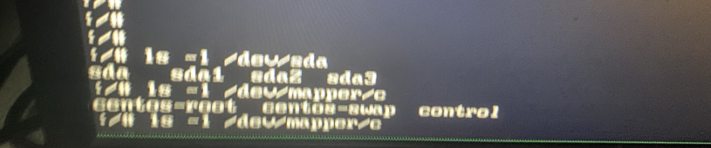

# 意外断电导致系统启动失败

## 报错

- 环境： centos 7.9


## 排查

- 根据图片看，系统已经入应急恢复模式，重启无法解决自行恢复，且文件系统是 xfs
- 查看先前系统所有配置的文件系统

```shell
# 检查机器硬件是否因断电导致损坏
- 机器运行正常

# 查看 /etc/fstab 文件，发现在该模式下，能看的只有 cat /etc/fstab.empty
cat /etc/fstab.empty   # 为空

# 查看 /dev/sd* 设备
ls -l /dev/sd*         # 发现有 3 个 sda 磁盘的分区 (sda1~3)

# 查看 /dev/mapper/ 目录下是否文件各文件系统
centos-root
centos-swap
```


## 结论

- 根据查到的磁盘设备和文件系统，怀疑是 centos-root 根分区导致，因启动启动需要加载该分区下的配置，一次启动失败 (断电当时应用系统仍在写数据，导致该分区产生脏数据)
- 对于重要数据建议先备份再进行修复 [xfs_backup_restore][Backing Up and Restoring XFS File Systems]

## 修复

- 使用 xfs_repair 修复文件系统

```shell
xfs_repair /dev/mapper/centos-root
```


- 修复后重启，系统启动正常
  1. 建议备份下 /etc/fstab、及 lsblk 信息，再有此类文件可以清楚的看到之前分区表信息

## 参考链接

- [Repairing an XFS File System](https://access.redhat.com/documentation/en-us/red_hat_enterprise_linux/7/html/storage_administration_guide/xfsrepair)
- [Running repairs on XFS Filesystems](https://www.thegeekdiary.com/running-repairs-on-xfs-filesystems/)
- [Backing Up and Restoring XFS File Systems]: https://access.redhat.com/documentation/en-us/red_hat_enterprise_linux/7/html/storage_administration_guide/xfsbackuprestore
